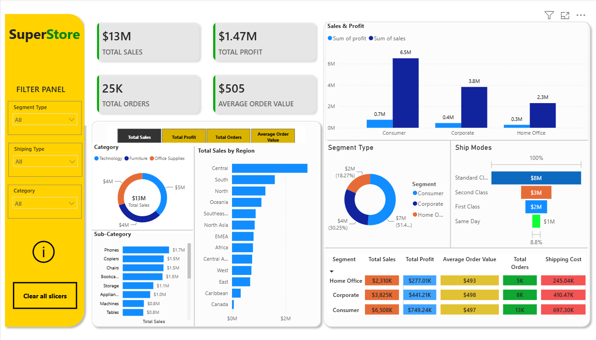
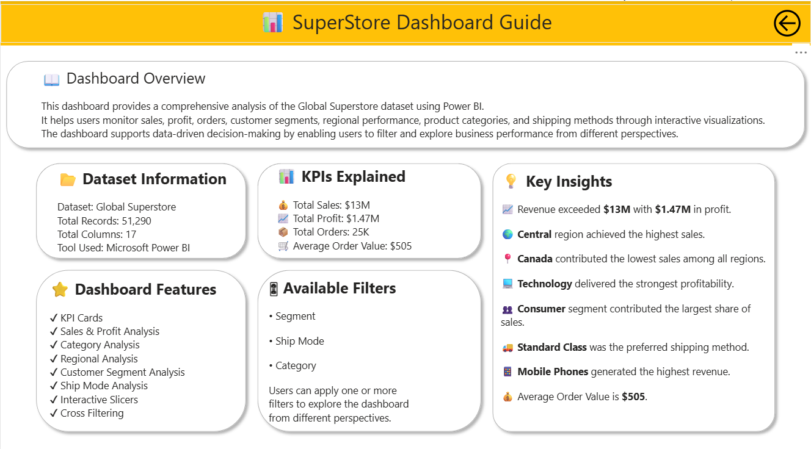

# 📊 Global Superstore Sales Analysis Dashboard

An interactive **Business Intelligence Dashboard** built using **Power BI, PostgreSQL, SQL, Power Query, and DAX** to analyze sales performance, profitability, customer behavior, product categories, and regional trends using the Global Superstore dataset.

---

## 📌 Project Overview

This project demonstrates an end-to-end data analytics workflow, from storing data in PostgreSQL to creating an interactive Power BI dashboard.

The dashboard provides valuable business insights through KPIs, charts, and interactive filters, helping users analyze sales trends, profitability, customer segments, shipping performance, and regional sales.

---

## 🚀 Project Workflow

1. Imported the Global Superstore dataset into **PostgreSQL**.
2. Performed business analysis using **SQL queries**.
3. Connected **Power BI** to PostgreSQL.
4. Cleaned and transformed data using **Power Query**.
5. Created KPIs and calculated measures using **DAX**.
6. Designed an interactive dashboard with slicers and visualizations.

---

## 🛠️ Tools & Technologies

- Microsoft Power BI
- PostgreSQL
- SQL
- Power Query
- DAX (Data Analysis Expressions)
- Microsoft Excel

---

## 📊 Dashboard Features

- 📈 Sales & Profit Analysis
- 💰 KPI Cards
  - Total Sales
  - Total Profit
  - Total Orders
  - Average Order Value
- 🌍 Regional Sales Analysis
- 📦 Category & Sub-Category Analysis
- 👥 Customer Segment Analysis
- 🚚 Shipping Mode Analysis
- 🎛 Interactive Slicers
- 🔄 Cross Filtering
- 📄 Dashboard Information Page

---

## 📊 Key Performance Indicators (KPIs)

| KPI | Value |
|------|--------|
| 💰 Total Sales | $13M |
| 📈 Total Profit | $1.47M |
| 📦 Total Orders | 25K |
| 🛒 Average Order Value | $505 |

---

## 💡 Key Business Insights

- 🌍 Central region generated the highest sales.
- 💻 Technology was the most profitable category.
- 📱 Mobile Phones generated the highest revenue.
- 👥 Consumer was the highest contributing customer segment.
- 🚚 Standard Class was the most frequently used shipping mode.
- 📈 Overall business performance remained profitable.
- 📊 SQL analysis identified top-performing and loss-making sub-categories.
- 💰 Discount analysis highlighted its impact on profitability.

---

## 🗄️ SQL Analysis

The SQL queries included in this project perform the following business analyses:

- Calculate Total Sales
- Calculate Total Profit
- Calculate Total Orders
- Calculate Average Order Value
- Top 10 Products by Sales
- Sales & Profit by Category
- Sales & Profit by Region
- Top 10 Customers by Sales
- Customer Segment Analysis
- Most Profitable Sub-Categories
- Loss-Making Sub-Categories
- Discount Impact on Profit

The SQL script is available in:

```text
SQL/analysis_queries.sql
```

---

## 📂 Dataset Information

| Item | Details |
|------|---------|
| Dataset | Global Superstore |
| Records | 51,290 |
| Columns | 17 |
| Database | PostgreSQL |

---

## 📈 Dashboard Pages

### 🏠 Dashboard

- KPI Cards
- Sales & Profit Analysis
- Regional Analysis
- Category Analysis
- Customer Segment Analysis
- Shipping Analysis
- Interactive Filters

### ℹ️ Dashboard Guide

- Dashboard Overview
- Dataset Information
- KPI Explanation
- Dashboard Features
- Available Filters
- Key Business Insights

---

## 🎯 Business Questions Answered

- Which region generates the highest sales?
- Which category is the most profitable?
- Which products generate the highest revenue?
- Which customer segment contributes the most sales?
- Which shipping mode is used most frequently?
- What is the average order value?
- How do discounts affect profitability?
- Which sub-categories generate losses?

---

## 📷 Dashboard Preview

### Main Dashboard



### Dashboard Guide



---

## 📥 How to Use

1. Clone or download this repository.
2. Open the `.pbix` file using **Microsoft Power BI Desktop**.
3. Restore or connect the PostgreSQL database (if required).
4. Refresh the data.
5. Explore the dashboard using interactive slicers and charts.

---

## 📁 Project Structure

```text
Global-Superstore-Sales-Analysis/
│
├── README.md
├── LICENSE
├── Superstore.pbix
├── global_superstore.csv
├── SQL/
│   └── analysis_queries.sql
├── Screenshots/
│   ├── Dashboard.png
│   └── Information_Page.png
```

---

## 📌 Skills Demonstrated

- SQL
- PostgreSQL
- Data Cleaning
- Data Transformation
- Data Modeling
- Power Query
- DAX
- KPI Development
- Dashboard Design
- Data Visualization
- Business Intelligence
- Business Analysis
- Interactive Reporting

---

## 👨‍💻 Author

**Krushna Sonawane**

📧 Email: krushnasonawane91@gmail.com

💼 LinkedIn: https://www.linkedin.com/in/krushna-sonawane-223725288/

🐙 GitHub: https://github.com/KrushnaSonawane91

---

## ⭐ Support

If you found this project useful, consider giving it a ⭐ on GitHub.
